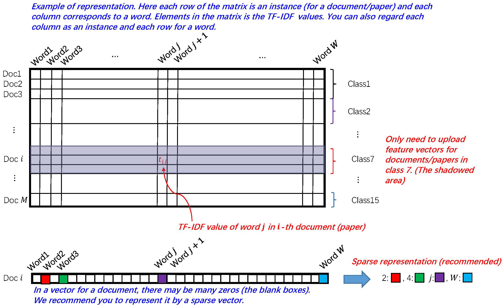

# DataMiningWork (数据挖掘课程作业)

[TOC]

---

## Assignment 1 : English Text Data Processing. - (Due on 16:59:59, Sept. 28, 2016)

### Task Requirement

1. First, please do the tokenization/stemming job to get the words from the English sentences. You may use some existing tools to help you accomplish the job.
2. Second, please delete the stop words and messy codes in the raw text file. If you use existing stop words list please clarify in your report.
3. Third, please extract TF-IDF (Term Frequency–Inverse Document Frequency) features from the raw text data on the basis of step 1 and step 2 above. You may learn or review TF-IDF here. Please implement extracting TF-IDF features by yourself, and do NOT invoke other existing codes or tools.
4. Four, please generate a dataset which contains TF-IDF features of ICML papers with 15 classes, this data may be used in the following assignments. In this assignment, you should upload the TF-IDF feature results of class “7. Kernel Methods”. Thoses features should be written in one text file named “results.txt”. In this file, each line corresponds to a paper. The order of papers should be in the lexicographical order.

### Task Detail

1. In this task, we only need to do data pre-processing, and classification/clustering is not required.
2. All documents (text file of papers) should be combined first. After removing stop words (such as “and”) and messy codes, some statistics (e.g., term frequency) of each word can be computed.
3. For each document (each paper, we can also regard it as an instance in a dataset), if there are totally W words in the corpus, it has a length W feature vector. Each term in the feature vector corresponds to the TF-IDF value of a single word. The order of the words in feature vectors should be the same for all documents, which are often in lexicographical order. The word list corresponds to the order of terms in feature vectors are also recommended to be included in the zip file.
4. The feature vector of each document should be a sparse vector (with lots of zero values). So sparse representation is recommended. For example, if you get a legnth 7 feature vector as [1.2, 0.6, 0, 0, 0, 0, 1], it should be transformed into [1:1.2, 2:0.6, 7:1].
5. After pre-processing, each document/paper has a legnth W (sparse) feature vector. Only features of papers in class “7. Kernel Methods” are required to upload.
6. Here is an example of representation:
